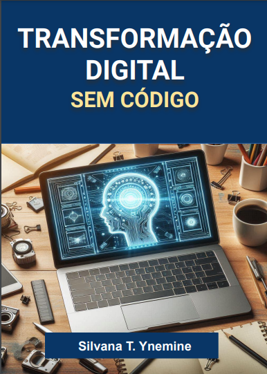

    

-------

# Projeto EBOOK Gerado por I.A.s

 > ℹ️ **NOTE:** Este é o repositório desenvolvido durante o bootcamp CAIXA - IA Generativa com Microsoft Copilot na plataforma da [DIO](https://dio.me)

Projeto com o objetivo de gerar um ebook digital com as facilidades das ferramentas de IA. todos os prompts
seguem abaixo.

<a href="https://github.com/silvanat/prompts-recipe-to-create-a-ebook/blob/main/output/ebook%20-%20css%20jedi%20output.pdf" title="View PDF now"> 📕Clique aqui para ler</a>

## 💻 Tecnologias utilizadas no projeto

- [ChatGPT](https://chat.openai.com/) 
- [Bing Image Creator](https://www.bing.com/)
- [Google Presentation](https://docs.google.com/presentation/)

## 🧠 Prompts

ChatGPT：
primeiro foi criado o texto do ebook e depois o título
| Ação   |  prompt                           |
| :---------- | :---------------------------------- |
| `Conteúdo` | `faça um texto para ebook com foco em usar plataformas no code e low code, informando as principais vantagens e desvantagens de se usar nas empresas {REGRAS}  > explique sempre de uma maneira simples  > Deixe o texto enxuto  > sempre deixe um título sugestivo por tópico` |
| `Título` |`crie um título curto para esse ebook. Me dê 5 opções de títulos. `|

Bing Image Creator：

|  Ação  | prompt                                                                                 |
| :----: | -------------------------------------------------------------------------------------- |
| título | crie uma imagem de uma tela de notebook em cima de uma mesa contendo imagens relacionadas a inteligencia artificial. Essa imagem deve ter tons na cor #3d70cb |

## ✨ Features

- Conteúdo gerado via ChatGPT
- Imagens geradas via Bing image creator
- Montagem do ebook no Google Presentation

## 📚 Materiais

- Imagens utilizadas em `assets`
- ebook gerado durante as aulas em `output`

## 👨‍💻 Expert

    
    
&nbsp&nbsp&nbspFelipe Aguiar 
    &nbsp&nbsp&nbsp
    <a href="https://github.com/silvanat">
    GitHub</a>&nbsp;|&nbsp;
    <a href="www.linkedin.com/in/
silvanaty">LinkedIn</a>
&nbsp;|&nbsp;
  

  

---

⌨️ com 💜 por [Silvana Ynemine](https://github.com/silvanat)
